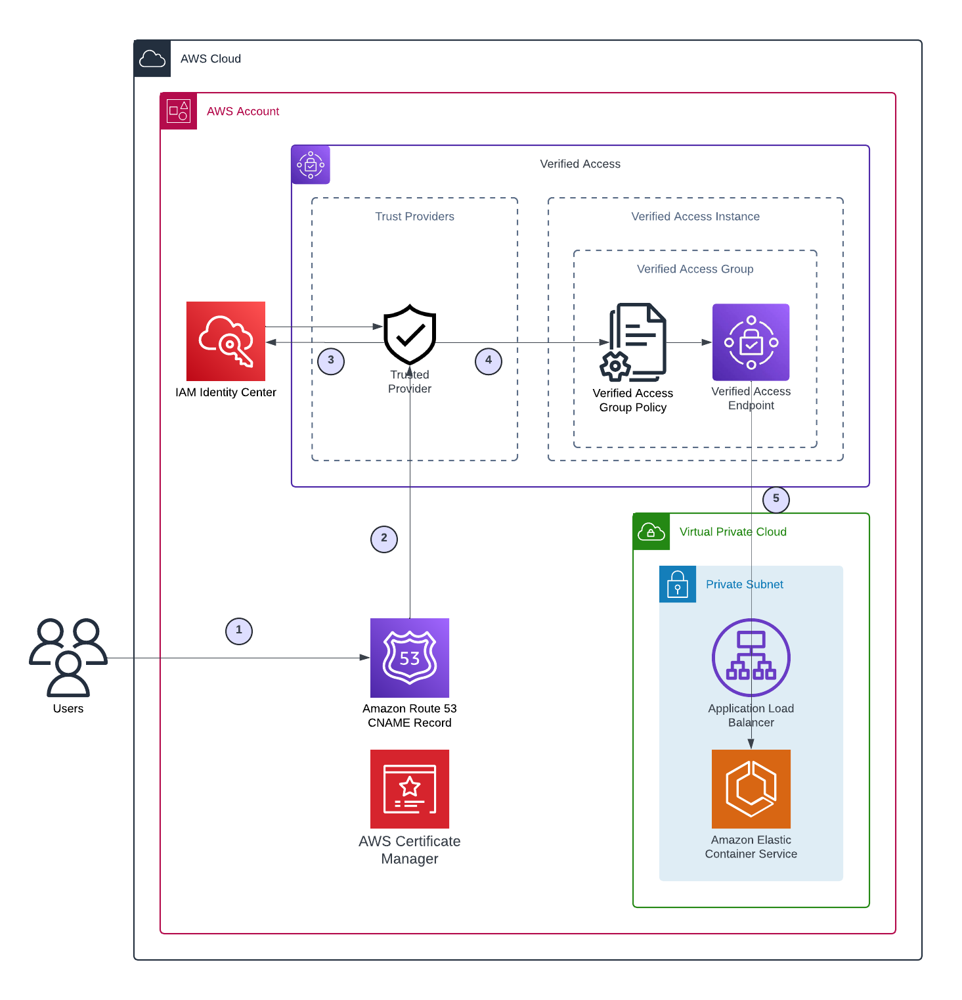
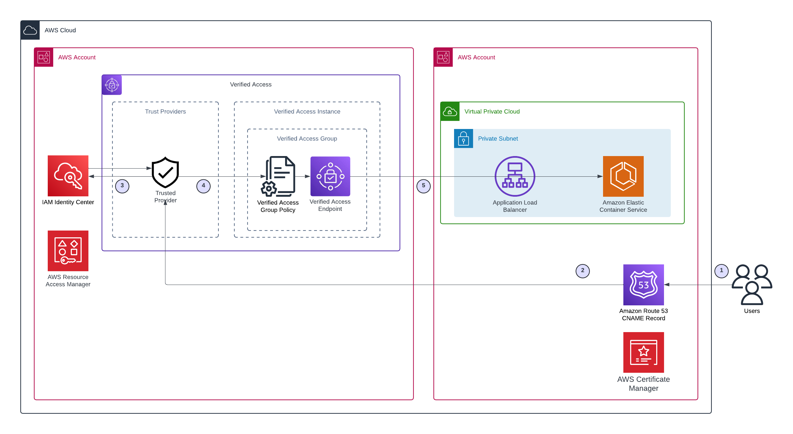

# Deploy an application behind AWS Verified Access using Terraform

## Description

Historically, customers that wanted to serve internal applications had to use a Virtual Private Network (VPN) to provide limited access when outside of the corporate network. Thanks to AWS Verified Access, it is possible to authenticate users and provide secure access over the public internet to private applications. The benefits of this artifact include,

- *Improved security posture:* A traditional security model evaluates access once and grants the user access to all applications. Verified Access evaluates each application access request in real time. This makes it difficult for bad actors to move from one application to another.
- *Integration with security services:* Verified Access integrates with identity and device management services, including both AWS and third-party services. Using data from these services, Verified Access verifies the trustworthiness of users and devices against a set of security requirements and determines whether the user should have access to an application.
- *Improved user experience and lower management costs:* Verified Access removes the need for users to use a VPN to access your applications. This helps reduce the number of support cases arising from VPN-related issues.
- *Simplified troubleshooting and audits:* Verified Access logs all access attempts, providing centralized visibility into application access, to help you quickly respond to security incidents and audit requests.

This artifact uses Terraform IaC to deploy a simple Proof of Concept (POC) that can be used to demonstrate the capabilities of AWS Verified Access or as a base to build upon with additional features.

### Proposed Features

- Secure access to an internal private application built on zero trust guiding principles
- Centralized access logging
- Easily deployed via Terraform

## Prerequisites

### Single Account Deployment

- One active AWS account
- An AWS CLI profile for the AWS account
- Terraform installed and configured locally or via a deployment pipeline
- AWS IAM Identity Center enabled
- An Amazon Route53 public Hosted Zone
- AWS Certificate Manager certificate, verified in the Amazon Route 53 Hosted Zone

### Multi-Account Deployment

- Two active AWS accounts, both in the same AWS Organization
- An AWS CLI profile for each AWS account
- Terraform installed and configured locally or via a deployment pipeline
- AWS IAM Identity Center enabled in a single account
- AWS Resource Access Manager sharing enabled for your AWS Organization [https://docs.aws.amazon.com/ram/latest/userguide/getting-started-sharing.html](https://docs.aws.amazon.com/ram/latest/userguide/getting-started-sharing.html)
- An Amazon Route53 public Hosted Zone [1] in the AWS account where the application resides
- AWS Certificate Manager certificate, verified in the Amazon Route 53 Hosted Zone in the AWS account where the application resides

## Diagrams

### Single Account Architecture

|  |
|:---|

### Multi-Account Architecture

|  |
|:---|

### Process Flow

1. User makes an initial request to `app1.example.com`; this request does not have an identity cookie
2. A Route 53 public CNAME record forwards to the public AWS Verified Access endpoint
3. AWS Verified Access collects the user identity from the chosen trust provider
4. AWS Verified Access references the Verified Access Group Policy for authorization
5. Traffic is routed to the AWS Verified Access Endpoint to reach the target application

Note: AWS Verified Access allows for continuous verification on each user access request, regardless of the number of times the user tries to access the application.

## Usage

### Local Deployment

There are two separate deployments in this repository:

1. The Prerequisites deployment
2. The Verified Access deployment

#### Prerequisites Deployment

The Prerequisites deployment performs the following steps:

1. Creates an S3 bucket and a DynamoDB lock table to manage Terraform state for the Verified Access deployment
2. Creates IAM roles and policies for managing the Verified Access deployment

##### Prereq Deployment Steps

1. To deploy resources to an AWS account, you must first authenticate using your terminal
2. Navigate to the top-level of this repo, then `cd prereqs`
3. Copy `example_terraform.tfvars` and rename to `terraform.tfvars`. Update the variables and config for your environment
   a. Ensure you set the region variable to the same region as your AWS IAM Identity Center instance
4. Run `terraform init` to initialize
5. Run `terraform plan` to review planned deployment changes
6. Run `terraform apply` and follow the prompts

#### Verified Access Deployment

##### VA Deployment Steps

1. Navigate to the top-level of this repo
2. Copy `example_terraform.tfvars` and rename to `terraform.tfvars`. Update the variables and config for your environment
3. Rename `example_backend.tf` to `backend.tf`. Modify the file by uncommenting the `terraform` block, and updating the `region`, `bucket`, and `dynamodb_table` values created in the Prerequisites deployment (available as part of the Terraform output)
4. Run `terraform init` to initialize
5. Run `terraform plan` to review planned deployment changes
6. Run `terraform apply` and follow steps to deploy

This deployment can take 15-20 mins to complete, so be patient. When finished, the Terraform output will contain the app URL.
Open the URL in a browser. If asked, authenticate with your AWS credentials. If successful, you should be redirected to your application!

#### Deployments Removal

To completely remove the resources for this proof of concept, the proper order is required.

1. Navigate to the top-level of this repo
2. Run `terraform destroy` and follow the prompts
3. Run `cd prereqs` to navigate to the prereqs deployment directory
4. Run `terraform destroy` and follow the prompts

### Deployment Pipeline

If you have an existing deployment pipeline, add the necessary Terraform files to your source control repository and trigger the pipeline to run.

## Support

Reach out to [avanbece@amazon.com](mailto:avanbece@amazon.com) for all inquiries.

## Roadmap

- [ ] Fine-grained access policies that include device security status

## Contributing

I am open to contributions to extend this product. Feel free to reach out with questions. I will review all merge requests. Create an issue [here](https://github.com/awslabs/aws-verified-access-poc-terraform/issues/new).

## Authors and Acknowledgment

- Andy Van Becelaere, <avanbece@amazon.com>
- Alicia Petrow <appetrow@amazon.com>

## Project Status

Active.

## Best Practices

The IAM policies generated for use in this proof of concept generally follow [least priviledge principles](https://docs.aws.amazon.com/wellarchitected/latest/framework/sec_permissions_least_privileges.html). Some policy actions only support the all resources wildcard (*). Code comments are used in the policy documents where this applies.

## Security

See [CONTRIBUTING](CONTRIBUTING.md#security-issue-notifications) for more information.

## License

This library is licensed under the MIT-0 License. See the [LICENSE](LICENSE) file.

## References

- [AWS Verified Access Product Page](https://aws.amazon.com/verified-access/)
- [AWS Verified Access Documentation](https://docs.aws.amazon.com/verified-access/latest/ug/what-is-verified-access.html)
- [Terraform AWS Provider Documentation for AWS Verified Access](https://registry.terraform.io/providers/hashicorp/aws/latest/docs/resources/verifiedaccess_instance)
- [Zero Trust on AWS](https://aws.amazon.com/security/zero-trust/)
- [Enable AWS Resource Access Manager for Organization](https://docs.aws.amazon.com/ram/latest/userguide/getting-started-sharing.html#getting-started-sharing-orgs)
- [Integrating AWS Verified Access with device trust providers](https://aws.amazon.com/blogs/networking-and-content-delivery/integrating-aws-verified-access-with-device-trust-providers/)
